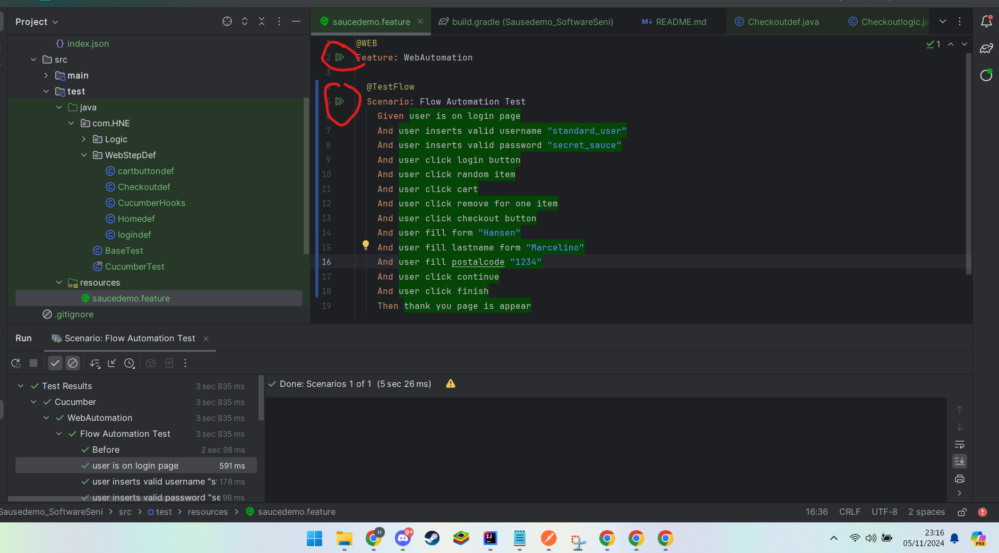

How to run the code -

I use cucumber, so you can run base on tag with command "./gradlew cucumber -Ptags="@WEB"

- If u want to run all schenario you can use command /*- ./gradlew cucumber test -*/
- if you want to run only specific schenario, you can use command like this  ./gradlew cucumber -Ptags="@WEB" - But u need to change the tag, base on schenario

or u can use this button

